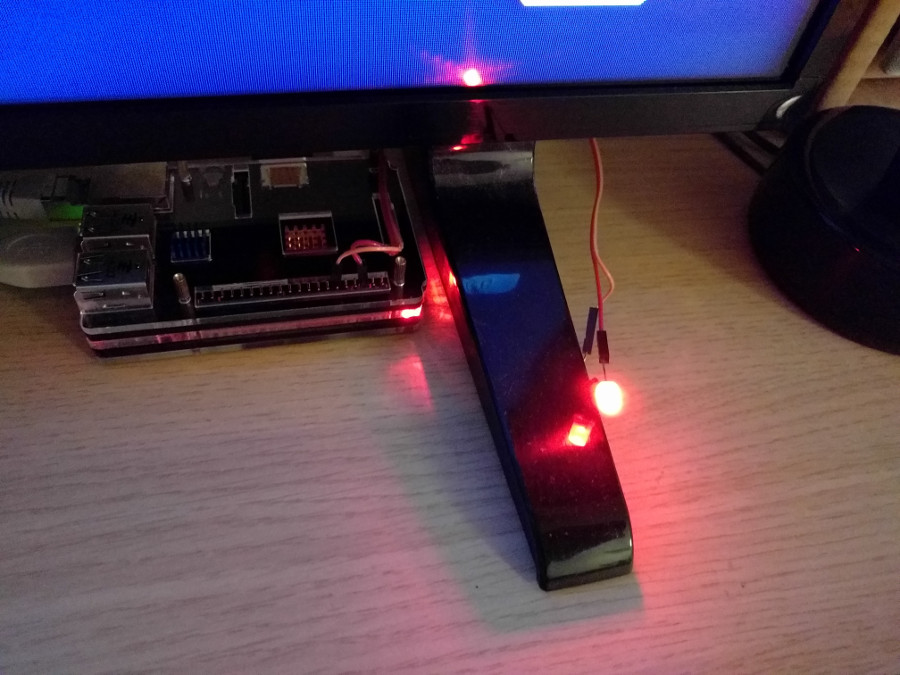

# rocketlight
Raspberry pi Rocket League LED notifier



## Description

A Python script to turn on a GPIO LED on Raspberry pi in case one of your selected friends is playing Rocket League.

## Usage
```
/input/apikey.txt
/input/rocketfriends.txt
``` 
- `apikey.txt` contains a single line with the Steam API key
- `rocketfriends.txt` contains a list of friends to check for RL status, on separate lines

## Requirements

- Raspberry pi
- Python 3
- smiley's steamapi library: https://github.com/smiley/steamapi
- RPi.GPIO library (installed by default on Raspbian)
